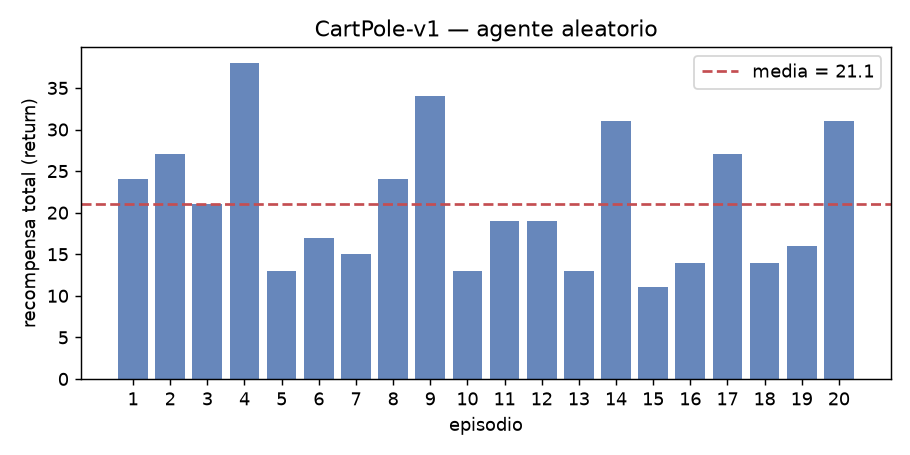
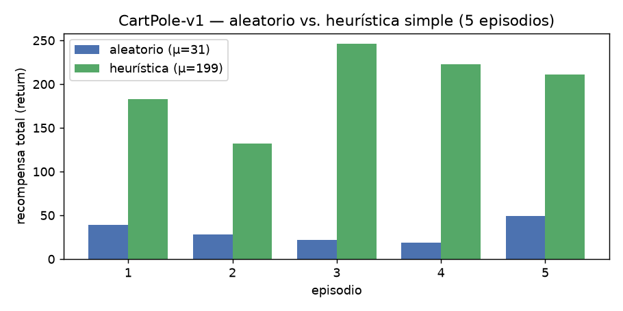

**Repositorio:** [github.com/AscencioSIUU/deepLearning/tree/main/labs/lab4RlGymnasium](https://github.com/AscencioSIUU/deepLearning/tree/main/labs/lab4RlGymnasium).
Fuentes: Sutton & Barto, *Reinforcement Learning: An Introduction*, 2.ª ed., 2018 [SB]; Gymnasium
docs (gymnasium.farama.org) [GYM]; Watkins & Dayan, "Q-learning", *Machine Learning* 8, 1992 [WD].

## 1. Fundamentos del aprendizaje por refuerzo

**RL vs. supervisado / no supervisado.** RL aprende *qué acción tomar* para maximizar recompensa
acumulada, descubriéndola por prueba y error; no hay etiqueta de la acción correcta (feedback
*evaluativo*, no *instructivo*) y las decisiones determinan qué datos se observan después. El
supervisado generaliza desde ejemplos `(entrada, salida correcta)`; el no supervisado busca
estructura oculta sin etiquetas. RL es un tercer paradigma, con exploración vs. explotación,
feedback retardado y datos no i.i.d. [SB, cap. 1].

**Componentes.** *Agente* (decide), *entorno* (recibe la acción y devuelve estado y recompensa),
*estado/observación* (la observación puede ser parcial), *acción* (discreta o continua),
*recompensa* `R_t` (escalar que define el objetivo), *política* `π(a|s)` (estrategia estado→acción,
lo que se aprende). Objetivo: maximizar el retorno `G_t = Σ_k γ^k R_{t+k+1}` [SB §3.1–3.3].

**MDP.** Formaliza la decisión secuencial bajo la propiedad de Markov (el futuro depende solo del
estado y acción actuales). Tupla `(S, A, P, R, γ)`: estados `S`; acciones `A`; transición
`P(s'|s,a)` (dinámica); recompensa esperada `R(s,a,s')`; descuento `γ∈[0,1]` que pondera el futuro
y mantiene finito el retorno en tareas continuas [SB, cap. 3].

**`V(s)` y `Q(s,a)`.** `V^π(s)=E_π[G_t|S_t=s]`: retorno esperado partiendo de `s` bajo `π`.
`Q^π(s,a)=E_π[G_t|S_t=s,A_t=a]`: idem tomando `a` y luego siguiendo `π`. Relación
`V^π(s)=Σ_a π(a|s)Q^π(s,a)`. Para la política óptima `V*(s)=max_a Q*(s,a)` y
`π*(s)=argmax_a Q*(s,a)`: conocer `Q*` basta para actuar óptimamente sin modelo del entorno
[SB §3.5–3.6].

**Ecuación de Bellman.** Expresa el valor de un estado en función del de sus sucesores: "valor
aquí = recompensa inmediata esperada + valor descontado del siguiente estado". Condición de
consistencia recursiva: `V^π(s)=Σ_a π(a|s) Σ_{s'} P(s'|s,a)[R(s,a,s')+γV^π(s')]`; la versión de
optimalidad reemplaza `Σ_a π(a|s)` por `max_a`. Rol: convierte una suma infinita sobre
trayectorias en un sistema de ecuaciones (una por estado); programación dinámica, Monte Carlo y
diferencia temporal la resuelven o aproximan [SB, cap. 3–6].

**Exploración vs. explotación.** Explotar da recompensa ya; explorar puede revelar algo mejor a
costa de recompensa a corto plazo. *ε-greedy*: acción greedy con probabilidad `1−ε`, aleatoria
uniforme con `ε` (que suele decaer); explora "a ciegas". *Softmax/Boltzmann*:
`π(a|s) ∝ exp(Q(s,a)/τ)`, temperatura `τ` de casi-uniforme (alta) a casi-greedy (baja); explora
proporcionalmente al valor estimado [SB, cap. 2].

**Familias de métodos.** *Episódicas* (estado terminal, retorno finito) vs. *continuas* (sin fin,
requieren `γ<1`); en Gymnasium `terminated` vs. `truncated`. *On-policy* (evalúa y mejora la misma
política que genera los datos, p. ej. SARSA) vs. *off-policy* (política objetivo ≠ política de
comportamiento, p. ej. Q-Learning). *Model-based* (aprende/usa `P` y `R` y planifica; eficiente en
muestras, sensible a error de modelo) vs. *model-free* (aprende de la experiencia directa; simple,
necesita más interacción) [SB §3.3–3.4, 5.5, 6.4, cap. 8].

**Q-Learning** [WD]. Model-free, off-policy, de diferencia temporal:
`Q(s,a) ← Q(s,a) + α[ r + γ·max_{a'} Q(s',a') − Q(s,a) ]`. El corchete es el *TD error*: distancia
entre la estimación actual y un objetivo mejor informado (recompensa observada + mejor valor
futuro estimado). Off-policy por el `max_{a'}` aunque `a` se haya elegido explorando. `α` (tasa de
aprendizaje) es el tamaño de paso hacia el objetivo: alta → rápido pero oscila; baja → lento pero
estable. `γ` pondera el término futuro: `γ→0` miope, `γ→1` previsor pero de propagación más lenta.

## 2. La librería Gymnasium

**Qué es / relación con OpenAI Gym.** Define una *API estándar* para entornos de RL y provee
entornos de referencia. Resuelve la *interoperabilidad*: con una interfaz común (`reset`, `step`,
espacios autodescritos) un mismo agente corre en cualquier entorno compatible y los resultados son
comparables. Es el fork mantenido de OpenAI Gym: OpenAI dejó de mantener Gym en 2021 y la Farama
Foundation lo continuó como Gymnasium en 2022. Reemplazo directo (`import gymnasium as gym`); el
cambio de API principal es que `step()` devuelve 5 valores separando `terminated` de `truncated`
(antes un único `done`) y `reset()` devuelve `(obs, info)` y acepta `seed=` [GYM].

**Estructura de un `Env`.** `reset(seed, options) → (observation, info)` inicia un episodio;
`step(action) → (observation, reward, terminated, truncated, info)` avanza un paso; `render()`
visualiza según `render_mode`; `close()` libera recursos. Tupla de `step()`: *observation*
(elemento del `observation_space`); *reward* (`float`); *terminated* (`True` en estado terminal del
MDP —meta, poste caído—: no hay valor futuro); *truncated* (`True` por corte externo, típicamente
el límite de pasos de `TimeLimit`; el estado no es terminal); *info* (`dict` de diagnóstico, no
para aprender). El episodio acaba con `terminated or truncated`.

**Spaces.** `Discrete(n, start=0)`: un entero en un rango finito — un valor categórico (acción de
CartPole `Discrete(2)`, obs de FrozenLake `Discrete(16)`). `Box(low, high, shape, dtype)`: tensor
de reales acotado elemento a elemento (`±inf` permitido) — magnitudes continuas, imágenes
`Box(0,255,(H,W,3),uint8)`, torques (obs de CartPole `Box(4,)`). `MultiDiscrete(nvec)`: vector de
enteros, componente `i` en `{0..nvec[i]−1}` — producto de varios `Discrete` para acciones con
varias dimensiones categóricas simultáneas (gamepad `[5,2,2]`). También `MultiBinary`, `Tuple`,
`Dict`.

**Catálogo — 4 entornos.**

| Entorno (familia) | Objetivo | Observación | Acción |
|---|---|---|---|
| CartPole-v1 (Classic Control) | equilibrar un poste sobre un carro; +1/paso hasta 500 | `Box(4,)`: pos. y vel. del carro, ángulo y vel. angular del poste | `Discrete(2)`: izq / der |
| MountainCar-v0 (Classic Control) | subir un carro sin potencia acumulando impulso; −1/paso (máx. 200) | `Box(2,)`: posición ∈[−1.2, 0.6], velocidad ∈[−0.07, 0.07] | `Discrete(3)`: acel. izq / nada / der |
| FrozenLake-v1 (Toy Text) | cruzar una grilla 4×4 helada del inicio a la meta sin caer en agujeros; +1 solo al llegar | `Discrete(16)`: casilla actual | `Discrete(4)`: izq/abajo/der/arriba (resbala si `is_slippery`) |
| LunarLander-v3 (Box2D) | aterrizar un módulo lunar sobre la plataforma; premia acercarse/aterrizar, penaliza chocar y gastar combustible | `Box(8,)`: pos. (x,y), vel. (vx,vy), ángulo, vel. angular, 2 flags de contacto | `Discrete(4)` motores (o `Box(2,)` continuo) |

**Wrappers.** Envuelven un `Env` y modifican su comportamiento sin tocar el código del entorno,
exponiendo la misma API (patrón decorador); se apilan — `gym.make("CartPole-v1")` ya devuelve
`TimeLimit(OrderEnforcing(PassiveEnvChecker(CartPoleEnv)))`. Ejemplos: `TimeLimit` (pone
`truncated=True` al llegar a `max_episode_steps`), `RecordVideo` (graba `.mp4`),
`RecordEpisodeStatistics` (agrega retorno y longitud a `info`), `NormalizeObservation` /
`NormalizeReward` (estandarizan con media/varianza corrientes), `RescaleAction`, `ClipAction`,
`FrameStackObservation`, `GrayscaleObservation`.

## 3. Módulo de prueba: resultados

CartPole-v1: `observation_space = Box(4,) float32` (pos. carro ±4.8, ángulo poste ±0.418 rad,
velocidades ±inf), `action_space = Discrete(2)`; recompensa +1/paso ⇒ return = pasos sobrevividos.
FrozenLake-v1 (`is_slippery=True`): `Discrete(16)` / `Discrete(4)`; recompensa +1 solo al alcanzar
la meta. Agente aleatorio = `action_space.sample()` en cada paso.

| Entorno / agente | Episodios | Return medio | Pasos medios | Éxito |
|---|---|---|---|---|
| CartPole-v1 / aleatorio | 20 | 20.7 ± 6.6 | 20.7 | — (máx. 500) |
| CartPole-v1 / aleatorio | 5 | 27.2 | 27.2 | — |
| CartPole-v1 / heurística (signo de `theta_dot`) | 5 | **199.0** | 199.0 | — |
| FrozenLake-v1 / aleatorio | 50 | 0.02 | 7.2 | **1 / 50 (2%)** |

{width=49%}
{width=49%}

## 4. Discusión y análisis

**Agente aleatorio: CartPole-v1 vs. FrozenLake-v1.** En CartPole el aleatorio acumula ~21 de
return medio (siempre obtiene *algo*); en FrozenLake alcanza la meta 1 de 50 veces (return medio
0.02). La causa es la *estructura de la recompensa*: CartPole es **densa** (+1 en cada paso, el
return degrada suavemente con la calidad de las acciones), FrozenLake es **dispersa y binaria**
(+1 solo en la meta, 0 en todo lo demás, sin señal intermedia) y además **estocástica** con el
hielo. El éxito exige ~6 acciones acertadas seguidas por un corredor rodeado de agujeros: al azar
ocurre ~2% de las veces y por suerte, no por estrategia. Esto anticipa la dificultad de *aprender*
en cada uno: en FrozenLake un agente necesita exploración dirigida o *reward shaping* solo para
encontrar la señal.

**¿La heurística superó al aleatorio?** Sí, 7×: **~199 vs. ~27** de return medio (5 episodios),
con **una sola regla** (empujar hacia el lado al que cae el poste según el signo de `theta_dot`) y
**cero entrenamiento**. Cuando el conocimiento del dominio es barato y confiable, es la vía más
eficiente en muestras: un agente de RL desde cero necesitaría miles de episodios para redescubrir
esa relación. Pero la heurística se estanca en ~200/500 porque ignora la posición del carro y solo
*reacciona* (no anticipa); un agente aprendido puede superar ese techo porque optimiza el objetivo
real sin que nadie codifique la regla completa —que en problemas complejos puede ser desconocida—.
La heurística es un excelente *baseline* y punto de partida (warm-start), no el destino.

**¿Por qué explorar con una política razonable?** Porque "razonable" ≠ "óptima", y una política
solo mejora sobre lo que **observa**. Si el agente siempre explota su regla actual, nunca genera
las transiciones que le mostrarían que controlar también la posición del carro rinde más: esos
estados quedan fuera de su distribución de datos y sus valores nunca se corrigen — se congela en un
**óptimo local** (~200) que *parece* el mejor solo porque no probó nada distinto. Explorar cuesta
recompensa a corto plazo (una acción exploratoria puede tirar el poste) pero es la única forma de
descubrir que existe algo mejor: ese es el dilema exploración vs. explotación, y por eso ε-greedy o
softmax mantienen algo de exploración incluso con una política decente.

**Entorno más interesante para un lab futuro: MountainCar-v0.** CartPole-v1 (`Box(4,)`/`Discrete(2)`)
es tan fácil que una heurística de una línea casi lo resuelve. FrozenLake-v1
(`Discrete(16)`/`Discrete(4)`) es tabular y minúsculo —Q-Learning tabular lo resuelve en pocas
líneas— pero enseña bien la exploración con recompensa dispersa. LunarLander-v3 (`Box(8,)`) es el
más realista pero pide DQN/PPO, demasiado para un primer lab. **MountainCar-v0**
(`Box(2,)`/`Discrete(3)`) es el punto medio: observación continua (obliga a discretizar el estado o
usar aproximación de funciones) y recompensa engañosa (−1/paso hasta llegar, la acción greedy
inmediata nunca es "subir directo": hay que aprender a retroceder para tomar impulso). Combina un
espacio manejable con crédito temporal y exploración real, sin el costo de simulación de Box2D —
exactamente los conceptos que un segundo lab de RL debería consolidar.
