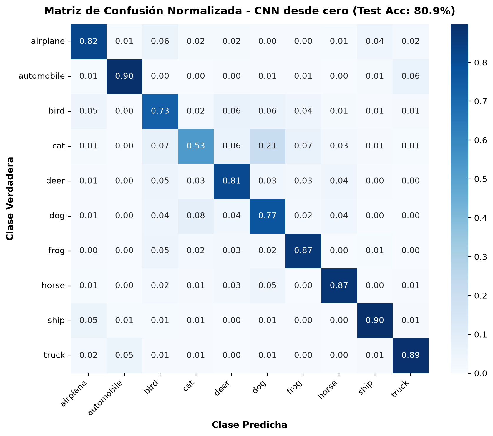
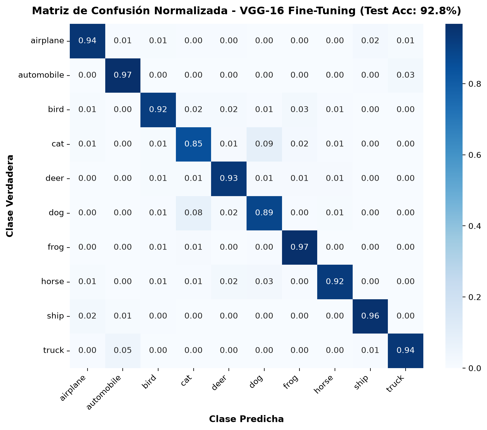
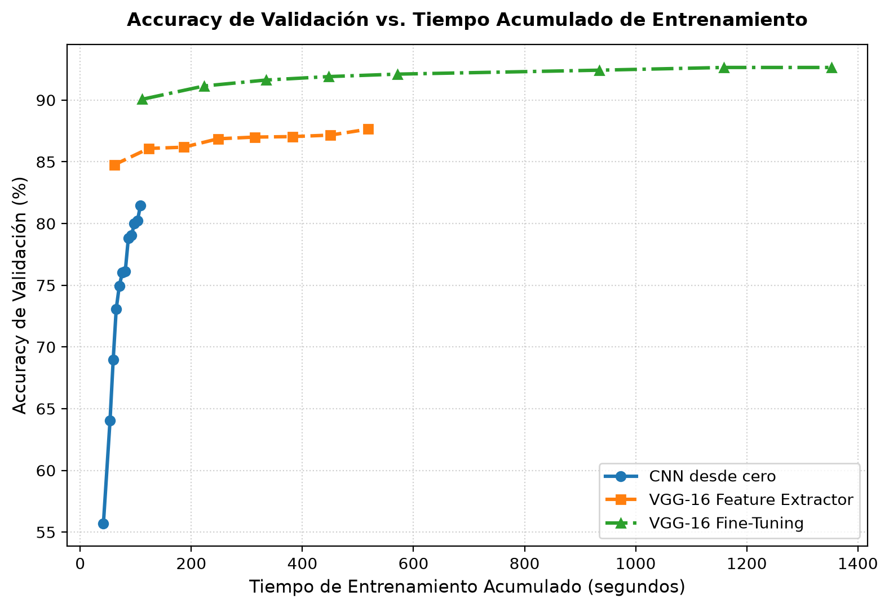
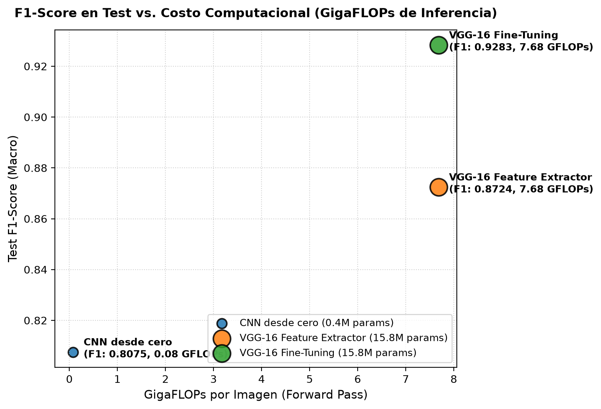

<h1 class="title">CC3092 — Deep Learning y Sistemas Inteligentes</h1>

Laboratorio #6: Transfer Learning y Fine-Tuning en CIFAR-10

Nesstor · github.com/nesstor/deepLearning/tree/main/labs/lab6-transfer-learning · Entrega: 30 de septiembre, 2026

# 1. Dataset y preparación de datos

CIFAR-10: 60,000 imágenes RGB de 32×32 px, 10 clases perfectamente balanceadas (6,000 img/clase: 5,000 train + 1,000 test). Split usado: **45,000 train / 5,000 val (estratificado)** y **10,000 test oficial**, reservado únicamente para la evaluación final.

Media/desviación estándar por canal calculadas sobre train vs. estadísticas de ImageNet:

| Canal | CIFAR-10 μ | CIFAR-10 σ | ImageNet μ | ImageNet σ |
|---|---|---|---|---|
| R | 0.4914 | 0.2470 | 0.4850 | 0.2290 |
| G | 0.4822 | 0.2435 | 0.4560 | 0.2240 |
| B | 0.4466 | 0.2616 | 0.4060 | 0.2250 |

Las estadísticas son cercanas pero no idénticas; para los modelos VGG-16 se normaliza con las medias/std de ImageNet (requisito de los pesos preentrenados), y la CNN propia se normaliza con las estadísticas calculadas de CIFAR-10.

Pares de clases esperados como difíciles (confirmado luego en las matrices de confusión, Sección 6): **cat/dog** (pose y textura similares), **automobile/truck** (siluetas rectangulares compartidas) y **airplane/bird/ship** (fondos homogéneos cielo/mar).

Pipelines: CNN entrena en resolución nativa 32×32 (1,024 px/imagen); VGG-16 redimensiona a 112×112 (12,544 px/imagen) en vez de 224×224 para reducir cómputo ~4× manteniendo la misma resolución en *feature extractor* y *fine-tuning*. Pasar de 32×32 a 224×224 multiplica los píxeles por 49× y el cómputo convolucional de forma aproximadamente proporcional.

Augmentation (solo en train, nunca en val/test para no contaminar la medición de generalización): `RandomCrop` con padding, `RandomHorizontalFlip` y jitter leve de color — aumentan la variabilidad efectiva de pose/iluminación sin alterar la clase. Ejemplos por clase visualizados en `docs/data_samples.png` (notebook, Sección 2).

# 2. Investigación: Transfer Learning en PyTorch

- **`vgg16` / `VGG16_Weights`**: carga arquitectura + pesos ImageNet; `weights.transforms()` expone el preprocesamiento oficial (resize, normalize) usado en el preentrenamiento.
- **`model.features` / `model.avgpool` / `model.classifier`**: bloques convolucionales, `AdaptiveAvgPool2d` (adapta cualquier resolución de entrada a un tamaño fijo de activación) y cabezal fully-connected.
- **`requires_grad`**: booleano por parámetro; se congela iterando `for p in module.parameters(): p.requires_grad = False`, descongelando selectivamente por índice de bloque (`features[24:]` = Bloque 5).
- **`model.train()` / `model.eval()` / `torch.no_grad()`**: alternan el comportamiento de `BatchNorm`/`Dropout` (estocástico vs. determinístico) y desactivan el cálculo de gradientes para inferencia, ahorrando memoria.
- **`param_groups`**: listas de diccionarios pasadas al optimizador, cada una con su propio `lr`, permiten LR bajo en el backbone preentrenado y LR alto en el clasificador nuevo.
- **`torchinfo.summary`**: reporta parámetros y `total_mult_adds` (MACs) por capa dado un `input_size`.
- **`torch.mps`/`cuda` `synchronize()` y `max_memory_allocated()`**: sincronizan el device asíncrono antes de medir tiempo/memoria real de GPU.

**MACs vs. FLOPs**: un MAC (multiply-accumulate) es una multiplicación + una suma; por convención 1 MAC ≈ 2 FLOPs. **Parámetros totales vs. entrenables**: totales cuenta todos los pesos del modelo; entrenables cuenta solo los que reciben gradiente (`requires_grad=True`), lo relevante para el costo del backward pass.

# 3. Iteraciones por modelo (9 totales)

| Iteración | Val F1 | Val Acc | Params Totales | Params Entrenables | Congelado | t/epoch (s) | t total (s) |
|---|---|---|---|---|---|---|---|
| C1: Baseline (sin aug, Adam 1e-3) | 0.8139 | 81.48% | 421,866 | 421,866 | Ninguno | 9.04 | 108.5 |
| C2: Data Aug + Cosine LR | 0.7697 | 77.04% | 421,866 | 421,866 | Ninguno | 6.87 | 82.4 |
| C3: 4 bloques + AdamW regul. | 0.7830 | 78.30% | 1,438,698 | 1,438,698 | Ninguno | 8.99 | 107.9 |
| F1: Replace-last (sin aug) | 0.8671 | 86.64% | 134,301,514 | 119,586,826 | Bloques 1–5 | 82.03 | 656.2 |
| **F2: Compact head + Data Aug** | **0.8761** | **87.64%** | 15,769,930 | 1,055,242 | Bloques 1–5 | 64.80 | 518.4 |
| F3: Compact + Cosine LR (4e-4) | 0.8736 | 87.38% | 15,769,930 | 1,055,242 | Bloques 1–5 | 67.98 | 543.9 |
| T1: Unfreeze Blk5 (BB 1e-5) | 0.9119 | 91.18% | 15,769,930 | 8,134,666 | Bloques 1–4 | 76.23 | 609.9 |
| **T2: Unfreeze Blk4+5 (BB 1e-5)** | **0.9265** | **92.64%** | 15,769,930 | 14,034,442 | Bloques 1–3 | 169.04 | 1352.3 |
| T3: Unfreeze Blk5, BB 5e-6 (conserv.) | 0.9034 | 90.34% | 15,769,930 | 8,134,666 | Bloques 1–4 | 125.38 | 1003.1 |

Mejores configuraciones (negrita) seleccionadas por `val_f1`: **C1** (CNN), **F2** (Feature Extractor), **T2** (Fine-Tuning). Curvas de pérdida train/val de las 9 iteraciones (3 por modelo) en `docs/loss_curves_*.png` y notebook — omitidas aquí por espacio. Ninguna iteración muestra *overfitting* severo (val_loss no diverge de train_loss); C2/C3 muestran *underfitting* leve relativo a C1 por mayor regularización.

# 4. Evaluación final en test y efecto de la cantidad de datos

| Modelo | Config. | Test Acc | Test Prec | Test Rec | Test F1 | Test Acc (10%) | Test F1 (10%) | Caída Acc |
|---|---|---|---|---|---|---|---|---|
| CNN desde cero | C1 | 80.92% | 81.03% | 80.92% | 80.75% | 52.97% | 52.10% | **-27.95%** |
| VGG-16 Feature Extractor | F2 | 87.29% | 87.28% | 87.29% | 87.24% | 83.14% | 83.10% | -4.15% |
| VGG-16 Fine-Tuning | T2 | 92.83% | 92.86% | 92.83% | 92.83% | 87.18% | 87.14% | -5.65% |

El experimento de 10% de datos reentrena cada modelo desde cero con la arquitectura ganadora real de cada categoría (C1/F2/T2), no una config fija arbitraria.

{width=55%} {width=55%}

# 5. Comparación de rendimiento y recursos

Hardware: **Apple M5 Pro (15 cores, 24 GB RAM), backend MPS, PyTorch 2.14.0**.

| Modelo | Params Tot. | Params Entr. | FLOPs/img | Lat. (ms) | t/epoch (s) | Épocas a mejor | t total (s) | Mem. pico (MB) | FLOPs entren. |
|---|---|---|---|---|---|---|---|---|---|
| CNN desde cero | 421,866 | 421,866 | 0.078 G | 1.37 | 9.04 | 12/12 | 108.5 | 1,101 | 125.6 TFLOPs |
| VGG-16 Feat. Extractor | 15.77 M | 1.06 M | 7.682 G | 2.77 | 64.80 | 8/8 | 518.4 | 6,222 | 2,903.9 TFLOPs |
| VGG-16 Fine-Tuning | 15.77 M | 14.03 M | 7.682 G | 2.44 | 169.04 | 7/8 | 1,352.3 | 6,222 | 6,084.3 TFLOPs |

{width=70%}
{width=70%}

# 6. Discusión y análisis

**Mejor modelo**: VGG-16 Fine-Tuning (92.83% test acc, F1 0.9283), +5.5 pts sobre Feature Extractor y +12 pts sobre la CNN desde cero. El costo extra (2.6× más tiempo de entrenamiento y 5.6× más TFLOPs que Feature Extractor) se justifica si la precisión es el objetivo principal; en inferencia el costo es idéntico a Feature Extractor (mismos FLOPs/latencia), así que el costo adicional es solo de entrenamiento, pagado una única vez.

**Mejor relación desempeño/recursos**: Feature Extractor — en la gráfica F1 vs. FLOPs queda cerca de Fine-Tuning en F1 con los mismos FLOPs de inferencia, pero a 1/3 del tiempo de entrenamiento y sin riesgo de *catastrophic forgetting*.

**Por qué transfieren features de 224×224 a 32×32**: los filtros de las primeras capas de VGG-16 detectan bordes, texturas y gradientes de color — patrones genéricos e independientes de la escala absoluta del objeto. `AdaptiveAvgPool2d` adapta el mapa de activaciones de cualquier resolución de entrada al tamaño fijo esperado por el clasificador. Redimensionar a 112×112 en vez de 224×224 reduce el cómputo ~4× con una pérdida de exactitud menor, porque las capas superiores igual logran discriminar con menor resolución espacial.

**Efecto de bloques descongelados / LR del backbone**: descongelar Bloques 4+5 (T2) superó a solo Bloque 5 (T1) en +1.5 pts F1 — más capacidad específica a CIFAR-10 — pero a 2.2× el tiempo de entrenamiento. Bajar el LR del backbone a 5e-6 (T3, conservador) *empeoró* el resultado frente a T1 (mismo unfreeze, LR 1e-5): backbone demasiado rígido, no llegó a adaptarse — indicio de *underfitting* del backbone, no de *catastrophic forgetting* (no hubo degradación de val_loss).

**Efecto de reducir datos (Sección 4.1)**: la CNN desde cero fue la más afectada (-27.95 pts acc), consistente con no tener prior alguno y depender enteramente de los datos vistos. Feature Extractor fue el más robusto (-4.15 pts) porque solo el clasificador ligero necesita datos; Fine-Tuning quedó en medio (-5.65 pts) por tener más parámetros entrenables expuestos a *overfitting* con pocos ejemplos. Confirma la regla práctica: con poco dato, preferir *feature extraction*; con dataset mediano/grande y dominio distinto al de preentrenamiento, *fine-tuning*; entrenar desde cero solo si hay datos abundantes o el dominio es muy distinto al de ImageNet.

**Matrices de confusión**: los tres modelos comparten el mismo par más confundido — **cat/dog** (CNN: 21% cat→dog; Fine-Tuning: 9% cat→dog, 8% dog→cat) — y una confusión secundaria menor **automobile/truck** (~5-6%). La CNN adicionalmente confunde **bird** con cat/deer por fondos compartidos, error que Fine-Tuning prácticamente elimina (bird 92% vs. 73% en CNN).

**Despliegue**: (a) servidor con GPU → **VGG-16 Fine-Tuning**, maximiza accuracy y el costo de inferencia es igual al de Feature Extractor. (b) dispositivo móvil → **CNN propia** (0.078 GFLOPs, 422K params, sin dependencia de un backbone de 15M parámetros) o, si se requiere transfer learning, un backbone eficiente como **MobileNetV3** o **EfficientNet-Lite**, diseñados para *edge computing* con FLOPs y memoria varios órdenes de magnitud menores que VGG-16.
