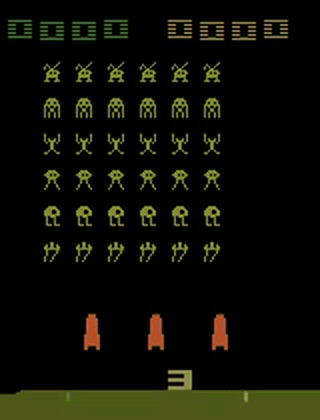
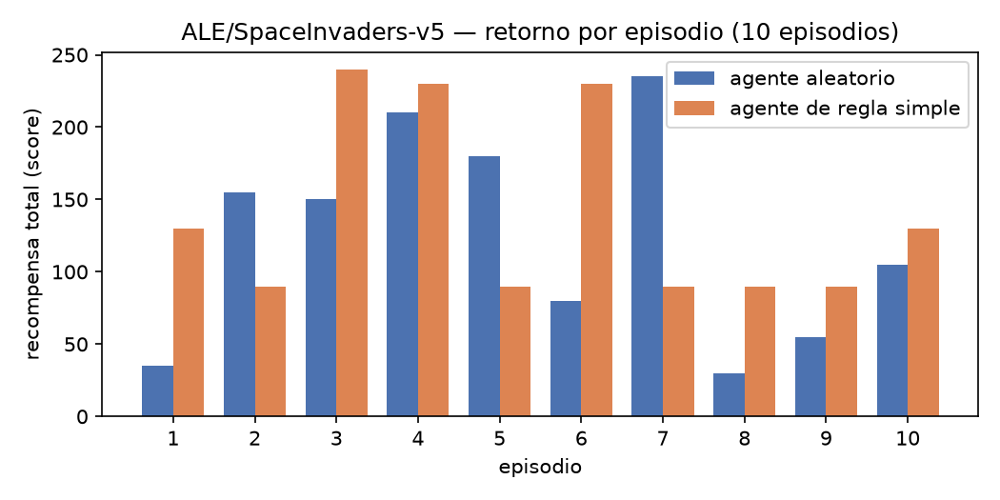

# Laboratorio #5 — Agentes en el Arcade Learning Environment: Space Invaders

**CC3092 Deep Learning y Sistemas Inteligentes**

Repositorio: <https://github.com/AscencioSIUU/deepLearning/tree/main/projects/space_invaders>

En este laboratorio **no se entrena ningún agente**. El objetivo es dejar funcionando la
infraestructura que permite que un agente (aleatorio o de regla simple) interactúe con un
entorno de Atari a través de ALE, y que esa interacción se **grabe en video**. Ese mismo
código es la base para entrenar agentes en proyectos futuros.

---

## Videos generados

### Agente aleatorio — `ALE/SpaceInvaders-v5`

Entregable principal: un episodio completo de `agente_aleatorio` (semilla 0).
**298 pasos sobrevividos, recompensa total 35.0.**



> Video en calidad original: [`videos/spaceinvaders_random-episode-0.mp4`](videos/spaceinvaders_random-episode-0.mp4)

### Agente de regla simple — `ALE/SpaceInvaders-v5`

Un episodio completo de `agente_regla_simple` (semilla 0), la política fija que barre de
lado a lado disparando. **405 pasos sobrevividos, recompensa total 130.0.**


> Video en calidad original: [`videos/spaceinvaders_regla-episode-0.mp4`](videos/spaceinvaders_regla-episode-0.mp4)

Los GIF son previsualizaciones a 15 fps generadas desde los `.mp4`; los archivos `.mp4` de
`videos/` son los entregables reales, producidos por `gymnasium.wrappers.RecordVideo`.

---

## El módulo: `ale_utils.py`

Cinco funciones reutilizables, con las firmas exactas que pide el enunciado. El notebook las
**importa**; no las redefine. Son genéricas: la misma llamada sirve para
`ALE/SpaceInvaders-v5` y para `CartPole-v1`.

| Función | Qué hace |
|---|---|
| `crear_entorno(nombre_entorno, video_folder=None, episode_trigger=None, name_prefix="rl-video", render_mode="rgb_array", **kwargs)` | Crea el entorno y, si se da `video_folder`, lo envuelve con `RecordVideo`. Los `kwargs` pasan a `gym.make` (`obs_type`, `frameskip`, `full_action_space`, …) |
| `agente_aleatorio(observation, env)` | Baseline: `env.action_space.sample()`. Ignora la observación |
| `agente_regla_simple(observation, env)` | Política fija no aprendida: alterna `RIGHTFIRE`/`LEFTFIRE` cada 20 pasos |
| `ejecutar_episodio(env, funcion_agente, max_steps=10000, seed=None)` | Corre un episodio hasta `terminated`/`truncated` o `max_steps`. Retorna `(pasos, recompensa_total)` |
| `generar_video_agente(nombre_entorno, funcion_agente, video_folder, name_prefix, n_episodios=1, ...)` | Combina las anteriores, cierra el entorno y retorna `(rutas_mp4, metricas)` |

### Uso

```python
import ale_utils

# 1. Grabar un episodio de un agente aleatorio en Space Invaders
rutas, metricas = ale_utils.generar_video_agente(
    "ALE/SpaceInvaders-v5", ale_utils.agente_aleatorio,
    video_folder="videos", name_prefix="spaceinvaders_random",
    n_episodios=1, seed=0)
print(rutas, metricas)   # (['videos/...mp4'], [(298, 35.0)])

# 2. Las mismas funciones sobre un entorno no-Atari
env = ale_utils.crear_entorno("CartPole-v1")
pasos, retorno = ale_utils.ejecutar_episodio(env, ale_utils.agente_aleatorio, seed=0)
env.close()

# 3. Variantes de observación
env = ale_utils.crear_entorno("ALE/SpaceInvaders-v5", obs_type="ram")   # Box(0,255,(128,),uint8)
```

### Cuatro detalles que no son opcionales

Cada uno costó una corrida fallida y está documentado en el código:

1. **`gym.register_envs(ale_py)`** al importar el módulo. Desde `ale-py` 0.10, sin esa llamada
   `gym.make("ALE/SpaceInvaders-v5")` lanza `NameNotFound`.
2. **`env.close()`** en un `finally`. `RecordVideo` escribe el archivo al cerrar el entorno:
   sin `close()` el último `.mp4` queda vacío.
3. **`env.action_space.seed(seed)`**. `env.reset(seed=...)` **no** siembra el RNG del espacio
   de acciones, así que `agente_aleatorio` daba números distintos en cada corrida.
4. **Reinicio del estado del agente.** `agente_regla_simple` lleva un contador de pasos; si no
   se reinicia por episodio, el resultado depende de cuántas veces se llamó antes al agente
   (el mismo experimento daba 141 o 207 según si se habían grabado videos primero).
   `ejecutar_episodio` llama a `funcion_agente.reset()` cuando el agente expone ese atributo.

---

## Resultados

10 episodios por agente, semillas 0–9, sin grabar video:

| Agente | Retorno medio | Desv. est. | Mín. | Máx. | Pasos medios |
|---|---|---|---|---|---|
| aleatorio | 123.5 | 69.5 | 30 | 235 | 461.0 |
| regla simple | 141.0 | 62.4 | 90 | 240 | 406.7 |



La regla simple le gana al azar por ~14%, pero con desviaciones de ese tamaño y sólo 10
episodios la diferencia **no es concluyente**. Lo que sí es claro es que la regla **sobrevive
menos** (406.7 contra 461.0 pasos) y aun así puntea más: no juega mejor a la defensiva, sólo
dispara más por unidad de tiempo. Tres razones acotan la mejora:

1. **Sticky actions.** Con `repeat_action_probability=0.25` una de cada cuatro acciones se
   ignora y se repite la anterior, así que el barrido "determinista" se degrada solo.
2. **La regla no mira la pantalla.** No esquiva balas ni apunta a nada, así que toda la
   ganancia viene de disparar más. Por eso muere antes.
3. **Disparar siempre no es gratis.** En Space Invaders sólo puede haber un disparo del
   jugador en pantalla a la vez, así que pulsar `FIRE` en cada paso no sube la cadencia por
   encima de ese límite.

Eso es justamente lo que motiva el aprendizaje: la política tiene que ser **función de la
observación**. El agente aleatorio no es relleno: es la línea base contra la que se mide
cualquier agente entrenado. ~124 puntos es el "cero" de este juego, frente a los ~1 700 que
reporta el DQN original.

---

## Investigación (en el notebook)

| Sección | Contenido |
|---|---|
| 1. ALE | Qué es y qué problema de evaluación resuelve; su relación con el emulador **Stella** y con las ROMs originales; variantes `v0`/`v4`/`NoFrameskip-v4`/`ALE/…-v5`; `frameskip`, `repeat_action_probability` (sticky actions) y `full_action_space`; frame skipping y su efecto en velocidad y aprendizaje; mecánica de Space Invaders y cómo el score se traduce a `reward` (`r_t = score_t − score_{t−1}`, señal dispersa y nunca negativa) |
| 2. Espacios | `Box(0,255,(210,160,3),uint8)` vs el `Box(4,)` de `CartPole-v1` y las cuatro implicaciones de usar imágenes (CNN, POMDP, memoria, escala); `obs_type="ram"` (`Box(0,255,(128,),uint8)`) y cuándo conviene; las 6 acciones (`NOOP`, `FIRE`, `RIGHT`, `LEFT`, `RIGHTFIRE`, `LEFTFIRE`) y `full_action_space=True` → `Discrete(18)`; `AtariPreprocessing` y `FrameStackObservation` documentados **sin aplicarse** |
| 3. Módulo | Las cinco funciones, genericidad sobre `CartPole-v1`, generación de los videos y comparación de agentes |
| 4. Discusión | Qué quedó funcionando, qué falta para entrenar, limitaciones |

Todas las afirmaciones sobre espacios y parámetros se verifican en vivo contra el entorno con
celdas de código, no de memoria.

---

## Estructura

```
projects/space_invaders/
├── ale_utils.py                   # el módulo (5 funciones + self-check)
├── build_nb.py                    # genera el notebook
├── lab5_ale_space_invaders.ipynb  # entregable: investigación + demo del módulo
├── build_report.sh                # reporte.md -> reporte.docx + reporte.pdf
├── requirements.txt
├── figs/                          # gráfica de comparación y GIFs de los videos
└── videos/                        # .mp4 entregables (RecordVideo)
```

> **No versionados** (quedan sólo en disco, por `.gitignore`): `reporte.md`, `reporte.pdf`,
> `reporte.docx`, `reference.docx`, `report.css`, `CLAUDE.md` y el PDF del enunciado. Para
> reconstruir el reporte hace falta copiar `report.css` y `reference.docx` desde
> [`labs/lab4RlGymnasium/`](../../labs/lab4RlGymnasium/).

---

## Reproducción

```sh
python3 -m venv .venv && source .venv/bin/activate
pip install -r requirements.txt

python ale_utils.py                          # self-check con asserts -> "self-check OK"
python build_nb.py                           # regenera el notebook
jupyter nbconvert --to notebook --execute --inplace lab5_ale_space_invaders.ipynb
sh build_report.sh                           # -> reporte.docx + reporte.pdf
```

El self-check de `ale_utils.py` valida: los espacios del entorno (`(210,160,3)` y
`Discrete(6)`), que ambos agentes devuelvan acciones válidas, la genericidad sobre
`CartPole-v1`, el corte por `max_steps`, la independencia del historial de llamadas, y que el
`.mp4` generado no quede vacío.

Dependencias: `gymnasium==1.3.0`, `ale-py>=0.12`, `moviepy`, `numpy`, `matplotlib`,
`nbformat`, `nbconvert`, `ipykernel`. Las ROMs de Atari vienen incluidas en `ale-py` ≥0.10;
no hace falta `AutoROM`. El binario de `ffmpeg` lo aporta `imageio-ffmpeg`.

---

## Reglas de tecnología

El objetivo del lab es la infraestructura, no entrenar un agente. De ahí las restricciones:

| | |
|---|---|
| **Permitido** | Python 3.10+, `gymnasium` 1.3.0, `ale-py` ≥0.12, `numpy`, `matplotlib`, `moviepy`/`imageio-ffmpeg` sólo como backend de `RecordVideo`, `nbformat`/`nbconvert` para el notebook, stdlib |
| **Entrenar agentes** | Prohibido: Q-learning, DQN, policy gradient, replay buffer, ε-greedy con decaimiento, redes neuronales, checkpoints. Sólo agente aleatorio y regla fija no aprendida |
| `torch`, `tensorflow`, `keras`, `jax` | Prohibidos: no hay modelo que entrenar |
| `stable-baselines3`, `ray[rllib]`, `tianshou`, `cleanrl` | Prohibidos: sustituyen la infraestructura que es el objeto del lab |
| `gym` legacy (OpenAI Gym) | Prohibido: mezclar APIs rompe el contrato de 5 valores de `step()` |
| `atari-py`, `AutoROM` | Prohibidos: obsoletos, `ale-py` ≥0.10 ya trae las ROMs |
| `opencv`, `Pillow` para preprocesar frames a mano | Prohibidos: para eso están los wrappers de Gymnasium |
| Escribir mp4 a mano (`imageio.mimwrite`, `ffmpeg` por `subprocess`) | Prohibido: el enunciado exige `gymnasium.wrappers.RecordVideo` |
| Clases, factories o capas de configuración sobre las 5 funciones | Prohibidas: deben quedar como funciones sueltas con las firmas del enunciado |
| `render_mode="human"` o dependencias de display | Prohibidos: grabar requiere `rgb_array` y el lab debe correr headless |

---

## Entregables

| Entregable | Archivo |
|---|---|
| Notebook | [`lab5_ale_space_invaders.ipynb`](lab5_ale_space_invaders.ipynb) |
| Módulo de funciones | [`ale_utils.py`](ale_utils.py) |
| Video, agente aleatorio | [`videos/spaceinvaders_random-episode-0.mp4`](videos/spaceinvaders_random-episode-0.mp4) |
| Video, agente de regla simple | [`videos/spaceinvaders_regla-episode-0.mp4`](videos/spaceinvaders_regla-episode-0.mp4) |
| Reporte PDF (3 páginas) | `reporte.pdf` — generado con `build_report.sh`, no versionado |
